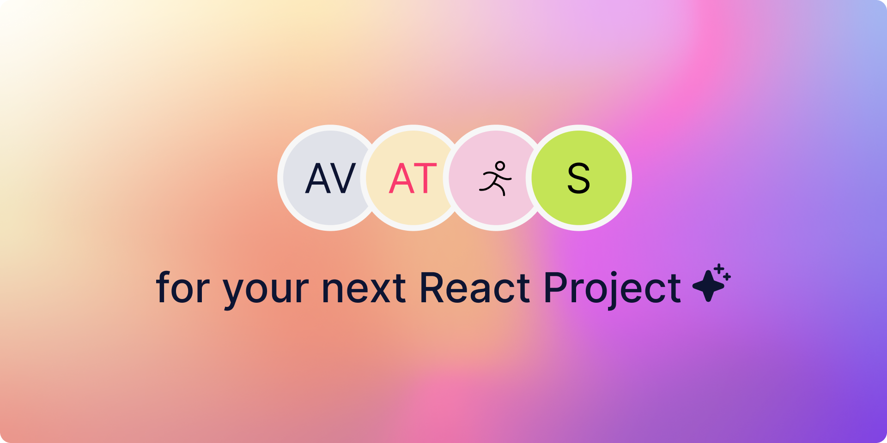

# Emojitar

An avatar libraray for your next react project. This library is inspired from [Avvvatars](https://github.com/nusu/avvvatars) and emojis are taken from [Phosphor Library](https://github.com/phosphor-icons)



[Visit the site](https://emojitars.super.site/) made with super.so

### Features =>
* Generate unique avatars for your users
* Highly customisable
* 0 dependencies
* Switch between initials or emojis

### Installation
Install it using you favourite packadge manager.
```bash
npm install emojitar
```

### Get started
Import the library and use the component
```jsx
import Avatar from 'emojitar'

export default function(props){
	return (
		<Avatar value="Ashish Khare" displayValue="ak"/>
	)
}
```

### Properties
1. value : string
	It is a required field and avatar is generated on the basis of this property.
```jsx
<Avatar value="flangdev3000@gmail.com" />
```

2. displayValue?: string
	It is the text that will be displayed instead of the value property in the avatar.
```jsx
<Avatar value="flangdev3000@gmail.com" displayValue="AK" />
```

3. emoji ?: none
	Just specify the prop emoji to display emoji instead of initials.
```jsx
<Avatar value="flangdev3000@gmail.com" emoji />
```

4. size ?: (number | 32)
	Specify the size of the avatar. Or it is set to 32 by default.
```jsx
<Avatar value="flangdev3000@gmail.com" size={36} />
```

5. radius ?: number
	Specify the radius of the avatar, else it defaults to full rounded corners.
```jsx
<Avatar value="flangdev3000@gmail.com" radius={6} />
```

6. shadow ?: none
	This property applies a subtle shadow beneath the avatar.
```jsx
<Avatar value="flangdev3000@gmail.com" shadow />
```

7. border ?: none
	Apply this property to activate border on the avatar.
```jsx
<Avatar value="flangdev3000@gmail.com" border />
```

8. borderSize ?: (number | 2)
	Set width of border. Defaults to 2. It is important to also pass border prop while using borderSize prop.
```jsx
<Avatar value="flangdev3000@gmail.com" border borderSize={6}/>
```

9. borderColor ?: string
	Accepts a string of valid CSS color code. Or else default to predefined color set.
```jsx
<Avatar value="flangdev3000@gmail.com" border borderColor="#06dea6" />
```

### Last Words
Hope you enjoy this library!

### License
MIT
